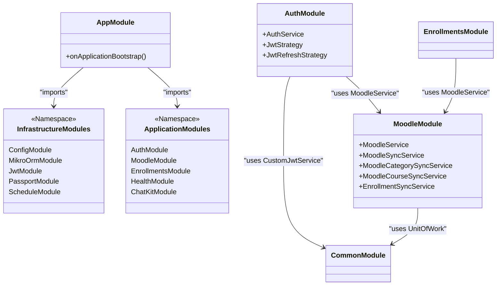
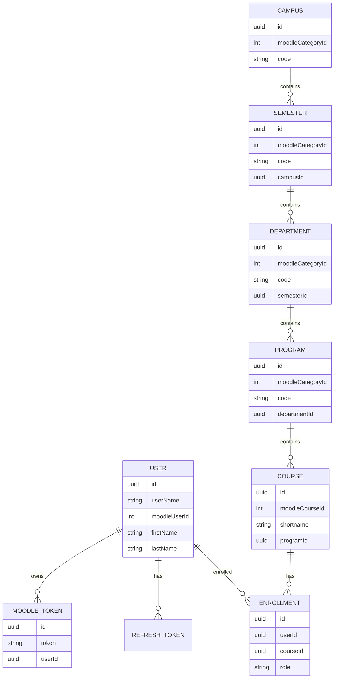
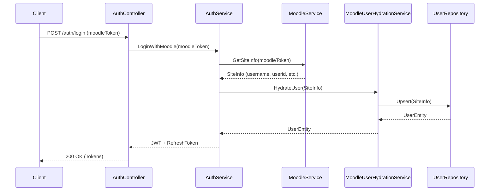
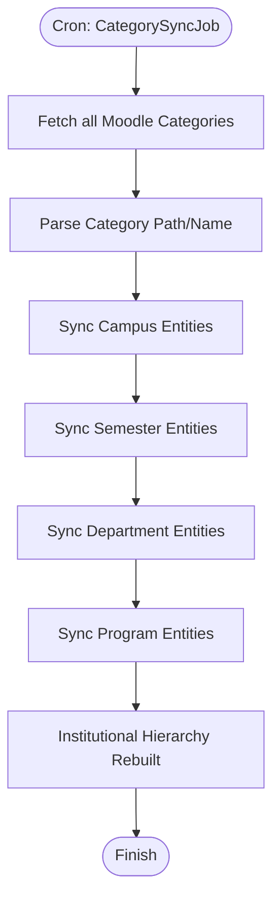

# Architecture Analysis: api.faculytics

This document provides a detailed overview of the software architecture for the `api.faculytics` project, a NestJS-based backend designed for Moodle integration.

## 1. System Overview

`api.faculytics` serves as an intermediary layer between Moodle and local institutional data. Its primary responsibilities include:

- **Authentication:** Authenticating users via Moodle tokens and issuing local JWTs.
- **Data Synchronization:** Mirroring Moodle's institutional hierarchy (Campuses, Semesters, Departments, Programs) and course enrollments.
- **Entity Management:** Maintaining a normalized local database for analytics and extended features.

## 2. Technology Stack

- **Backend Framework:** [NestJS](https://nestjs.com/) (v10+)
- **Database ORM:** [MikroORM](https://mikro-orm.io/) with PostgreSQL
- **Authentication:** Passport.js (JWT and Refresh Token strategies)
- **External API:** Moodle Web Services (REST)
- **Task Scheduling:** NestJS Schedule (Cron)
- **Validation:** Zod (Environment variables), class-validator (DTOs)

## 3. Module Architecture

The application is structured into **Infrastructure** and **Application** layers, coordinated by the `AppModule`.

## 4. Data Model (ERD)

The database schema reflects the institutional hierarchy derived from Moodle's category structure.

## 5. Core Workflows

### 5.1. Authentication & User Hydration

When a user logs in, the system synchronizes their Moodle profile information before issuing local tokens.

### 5.2. Institutional Hierarchy Synchronization

The system uses a background job to rebuild the local institutional hierarchy based on Moodle Categories.

## 6. Architectural Decisions

- **External ID Stability:** Moodle's `moodleCategoryId` and `moodleCourseId` are used as business keys for idempotent upserts to ensure primary key stability in the local database.
- **Unit of Work Pattern:** Leveraging MikroORM's `EntityManager` to ensure transactional integrity during complex synchronization processes.
- **Base Job Pattern:** All background jobs extend `BaseJob` to provide consistent logging, startup execution logic, and error handling.
- **Idempotency:** Sync services are designed to be run repeatedly without creating duplicate records or overwriting local customizations (like UUIDs).
