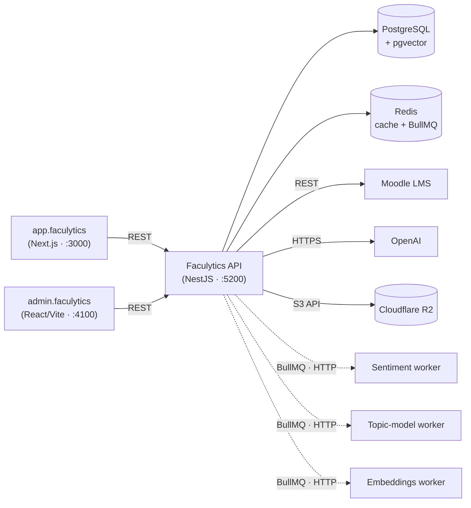

# Faculytics API

Faculytics is an analytics platform designed to integrate seamlessly with Moodle LMS. This repository contains the backend API built with NestJS.

## Tech Stack

- **Framework:** [NestJS](https://nestjs.com/) v11
- **ORM:** [MikroORM](https://mikro-orm.io/) with PostgreSQL
- **Validation:** [Zod](https://zod.dev/) & [class-validator](https://github.com/typestack/class-validator)
- **Authentication:** [Passport.js](http://www.passportjs.org/) (JWT + Moodle token strategies)
- **Job Queue:** [BullMQ](https://docs.bullmq.io/) on Redis
- **Caching:** Redis via `@keyv/redis`
- **Documentation:** [Swagger/OpenAPI](https://swagger.io/)

## Architecture

This API is the hub of the Faculytics system. It serves two frontends over REST, owns the
PostgreSQL and Redis datastores, calls external APIs (Moodle, OpenAI), stores generated reports in
Cloudflare R2, and dispatches asynchronous AI analysis to RunPod-hosted workers via BullMQ.



### Connected Services

Analysis workers get their own subsection below; this table covers datastores, external APIs, and
inbound clients. Sibling repos live under the [`CtrlAltElite-Devs`](https://github.com/CtrlAltElite-Devs) org.

| Service                                                                   | Type                           | Connection                                                                                    | Purpose                                                   |
| ------------------------------------------------------------------------- | ------------------------------ | --------------------------------------------------------------------------------------------- | --------------------------------------------------------- |
| [app.faculytics](https://github.com/CtrlAltElite-Devs/app.faculytics)     | Frontend (Next.js SPA)         | REST over HTTP, allowed via `CORS_ORIGINS`                                                    | Student / faculty / dean UI                               |
| [admin.faculytics](https://github.com/CtrlAltElite-Devs/admin.faculytics) | Admin console (React/Vite SPA) | REST over HTTP, allowed via `CORS_ORIGINS`                                                    | Questionnaire & system administration                     |
| PostgreSQL                                                                | Datastore                      | MikroORM via `DATABASE_URL`; pgvector extension (Neon-managed)                                | Primary relational store (768-dim embeddings)             |
| Redis                                                                     | Datastore / broker             | `REDIS_URL`, key prefix `faculytics:`                                                         | Caching + BullMQ job-queue backend                        |
| Moodle LMS                                                                | External API                   | REST (`MOODLE_BASE_URL`, `MOODLE_MASTER_KEY`)                                                 | User / course / enrollment sync + token login             |
| OpenAI                                                                    | External API                   | `OPENAI_API_KEY`                                                                              | ChatKit agents, recommendation generation, topic labeling |
| Cloudflare R2                                                             | Object storage                 | S3-compatible (`CF_ACCOUNT_ID`, `R2_ACCESS_KEY_ID`, `R2_SECRET_ACCESS_KEY`, `R2_BUCKET_NAME`) | Generated report files, served via presigned URLs         |

### Analysis Workers

AI analysis is dispatched asynchronously: each type has its own BullMQ queue and processor that
POSTs to an external, RunPod-hosted worker over HTTP, with responses validated by Zod. Domain
errors return `status: "failed"` (no retry); infrastructure errors raise and BullMQ retries. Worker
URLs are optional — the app boots without them, and `docker compose up` starts a Hono mock worker
(port 3001) that returns fake results for offline dev.

| Worker          | Repo                                                                                                      | BullMQ queue      | Env var                  | Purpose                                                                                                         |
| --------------- | --------------------------------------------------------------------------------------------------------- | ----------------- | ------------------------ | --------------------------------------------------------------------------------------------------------------- |
| Sentiment       | [sentiment.worker.temp.faculytics](https://github.com/CtrlAltElite-Devs/sentiment.worker.temp.faculytics) | `sentiment`       | `SENTIMENT_WORKER_URL`   | Comment sentiment classification (chunked by `SENTIMENT_CHUNK_SIZE`)                                            |
| Topic model     | [topic.worker.faculytics](https://github.com/CtrlAltElite-Devs/topic.worker.faculytics) (Python/BERTopic) | `topic-model`     | `TOPIC_MODEL_WORKER_URL` | Topic modeling; DTO contract in `src/modules/analysis/dto/topic-model-worker.dto.ts` ⇄ worker's `src/models.py` |
| Embeddings      | [embedding.worker.faculytics](https://github.com/CtrlAltElite-Devs/embedding.worker.faculytics)           | `embedding`       | `EMBEDDINGS_WORKER_URL`  | 768-dim submission embeddings                                                                                   |
| Recommendations | In-process (OpenAI, not an external worker)                                                               | `recommendations` | `OPENAI_API_KEY`         | Structured recommendation generation                                                                            |

[worker.smoketests.faculytics](https://github.com/CtrlAltElite-Devs/worker.smoketests.faculytics) is
a sibling Python CLI that tests the workers directly and does **not** call this API (so it's not in
the diagram). The full BullMQ queue inventory also includes `moodle-sync`, `analytics-refresh`,
`audit`, `report-generation`, and `error-log`.

> For the full multi-project system overview (all five repos), see the root [`../CLAUDE.md`](../CLAUDE.md).

## Prerequisites

- **Node.js:** v22.x or later
- **PostgreSQL:** A running instance of PostgreSQL
- **Redis:** Required for caching and job queues
- **Moodle:** A Moodle instance with **Mobile Web Services** enabled

## Getting Started

### 1. Installation

```bash
npm install
```

### 2. Environment Setup

Copy the sample environment file and update the variables:

```bash
cp .env.sample .env
```

**Required Variables:**

| Variable            | Description                                                           |
| ------------------- | --------------------------------------------------------------------- |
| `DATABASE_URL`      | PostgreSQL connection string (supports Neon.tech SSL)                 |
| `MOODLE_BASE_URL`   | Base URL of your Moodle instance (e.g., `https://moodle.example.com`) |
| `MOODLE_MASTER_KEY` | Moodle web services master key                                        |
| `JWT_SECRET`        | Secret for signing access tokens                                      |
| `REFRESH_SECRET`    | Secret for signing refresh tokens                                     |
| `REDIS_URL`         | Redis connection URL (e.g., `redis://localhost:6379`)                 |
| `CORS_ORIGINS`      | JSON array of allowed origins (e.g., `["http://localhost:4100"]`)     |
| `OPENAI_API_KEY`    | OpenAI API key (for ChatKit and recommendation engine)                |

**Optional Variables:**

| Variable                               | Default       | Description                                                                                |
| -------------------------------------- | ------------- | ------------------------------------------------------------------------------------------ |
| `PORT`                                 | `5200`        | Server port                                                                                |
| `NODE_ENV`                             | `development` | `development` \| `production` \| `test`                                                    |
| `OPENAPI_MODE`                         | `false`       | Set to `"true"` to enable Swagger docs                                                     |
| `SUPER_ADMIN_USERNAME`                 | `superadmin`  | Default super admin username (also used by the tiered scheduler for system attribution)    |
| `SUPER_ADMIN_PASSWORD`                 | `password123` | Default super admin password                                                               |
| `SYNC_ON_STARTUP`                      | `false`       | Run course and enrollment sync on startup                                                  |
| `DISABLE_SYNC_CATEGORY_ON_STARTUP`     | `false`       | Skip category sync on startup (faster dev restarts)                                        |
| `MOODLE_SYNC_CONCURRENCY`              | `3`           | Max concurrent Moodle HTTP calls during sync (1-20)                                        |
| `SENTIMENT_WORKER_URL`                 | —             | RunPod/mock worker URL for sentiment analysis                                              |
| `SENTIMENT_CHUNK_SIZE`                 | `50`          | Submissions per sentiment chunk dispatched to the worker                                   |
| `ALLOW_SENTIMENT_VLLM_ENABLED_IN_PROD` | `false`       | Production safety gate — must be `true` to enable vLLM dispatch when `NODE_ENV=production` |

See `.env.sample` for the full list including BullMQ, embeddings, topic-model, and recommendation worker options.

### 3. Database Initialization

This project uses MikroORM migrations. By default, **migrations are automatically applied** when the application starts.

To manage migrations manually:

```bash
# Create a new migration
npx mikro-orm migration:create

# Apply pending migrations
npx mikro-orm migration:up

# Check migration status
npx mikro-orm migration:list
```

### 4. Local Development with Docker

```bash
# Start Redis + mock analysis worker
docker compose up
```

This starts:

- **Redis** on port 6379 (required for caching and BullMQ job queues)
- **Mock worker** on port 3001 (simulates analysis worker responses for local dev)

## Running the Project

```bash
# Development (with watch mode)
npm run start:dev

# Production mode
npm run build
npm run start:prod
```

## API Documentation

Once the application is running, you can access the interactive Swagger documentation at:
`http://localhost:5200/swagger`

## Development Workflow

- **Linting:** `npm run lint`
- **Formatting:** `npm run format`
- **Husky:** Pre-commit hooks are enabled to ensure code quality (Linting + Formatting).

## Testing

```bash
# Unit tests
npm run test

# E2E tests
npm run test:e2e

# Test coverage
npm run test:cov
```

## License

This project is [UNLICENSED](LICENSE).
