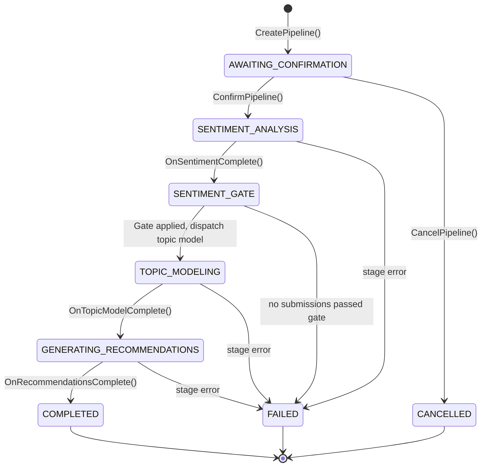

# AI & Inference Pipeline

> **Status:** Implemented (FAC-46) — Pipeline orchestrator, all four processors, and REST controller are live.

## 1. Architecture: NestJS Orchestrator + HTTP Workers

```
┌──────────────────────┐         ┌─────────────┐         ┌──────────────────┐
│  NestJS API          │────────▶│   BullMQ    │────────▶│  Batch Processors│
│  - Controller        │         │  (Redis)    │         │  - Sentiment     │
│  - Orchestrator      │         │             │         │  - Topic Model   │
│  - AnalysisService   │         │  sentiment  │         │  - Recommendations│
│                      │         │  embedding  │         │  - Embedding     │
│  writes to           │◀────────│  topic-model│         └────────┬─────────┘
│  database            │ results │  recommend. │                  │ HTTP POST
└──────────────────────┘         └─────────────┘                  ▼
                                                       ┌──────────────────┐
                                                       │  External Workers │
                                                       │  (HTTP endpoints) │
                                                       │  - RunPod (GPU)   │
                                                       │  - LLM APIs       │
                                                       │  - Mock Worker    │
                                                       └──────────────────┘
```

**Key principle:** Workers are **pure compute** HTTP endpoints — they receive JSON input via POST, return JSON results. NestJS owns all database access, business logic, queuing, and retry logic. Workers never touch the database.

## 2. Pipeline Lifecycle

The pipeline follows a **confirm-before-execute** pattern with sequential stage progression:



### Stage Details

| Stage                  | Input                                   | Output                                                                   |
| ---------------------- | --------------------------------------- | ------------------------------------------------------------------------ |
| **Create**             | Scope filters (semester, faculty, etc.) | Coverage stats, warnings, `AnalysisPipeline` entity                      |
| **Confirm**            | Pipeline ID                             | Embedding backfill (best-effort), sentiment dispatch                     |
| **Sentiment Analysis** | Batch of comments                       | Per-submission sentiment scores                                          |
| **Sentiment Gate**     | Sentiment results                       | Filtered corpus (negative/neutral always pass; positive needs ≥10 words) |
| **Topic Modeling**     | Gate-passing submissions + embeddings   | Topics, keyword clusters, soft assignments                               |
| **Recommendations**    | Aggregated sentiment + topics           | Prioritized action items                                                 |

### Coverage Warnings

The orchestrator generates warnings at pipeline creation when:

| Condition                  | Threshold  |
| -------------------------- | ---------- |
| Low response rate          | < 25%      |
| Insufficient submissions   | < 30       |
| Insufficient comments      | < 10       |
| Post-gate corpus too small | < 30       |
| Stale enrollment data      | > 24 hours |

## 3. Batch Message Contract

Pipeline-driven stages use a **batch envelope** (all items in one job):

```typescript
// Outbound: Orchestrator → BullMQ queue
BatchAnalysisJobMessage {
  jobId: string;        // UUID
  version: string;      // Contract version (e.g., "1.0")
  type: string;         // "sentiment" | "topic-model" | "recommendations"
  items: Array<{
    submissionId: string;
    text: string;
    embedding?: number[];  // topic-model only
  }>;
  metadata: {
    pipelineId: string;
    runId: string;
  };
  publishedAt: string;  // ISO 8601
}

// Inbound: Worker HTTP response → validated by processor
BatchAnalysisResultMessage {
  version: string;
  status: "completed" | "failed";
  results?: Array<Record<string, unknown>>;  // Type-specific items
  error?: string;
  completedAt: string;
}
```

The embedding processor uses the original single-item `AnalysisJobMessage` contract since it processes individual submissions independently.

Worker-specific response schemas are validated by each processor:

- Sentiment: `sentimentResultItemSchema` (positive/neutral/negative scores)
- Topic model: `topicModelWorkerResponseSchema` (topics + assignments + metrics)
- Recommendations: `recommendationsWorkerResponseSchema` (actions with priority + evidence)

See `docs/worker-contracts/` for full per-worker contracts.

## 4. Sentiment Gate

Between sentiment analysis and topic modeling, a **sentiment gate** filters the corpus:

- **Negative/Neutral** comments always pass (they contain the most actionable feedback)
- **Positive** comments must have ≥ 10 words to pass (short "great!" responses add noise to topic modeling)
- Results are stored as `passedTopicGate` on `SentimentResult` via bulk `nativeUpdate`
- Gate statistics (`sentimentGateIncluded`, `sentimentGateExcluded`) are persisted on the pipeline

## 5. Queue Architecture

Four BullMQ queues with independent configuration:

| Queue             | Contract    | Concurrency | Purpose                          |
| ----------------- | ----------- | ----------- | -------------------------------- |
| `sentiment`       | Batch       | 3           | Sentiment classification         |
| `embedding`       | Single-item | 3           | Vector embedding generation      |
| `topic-model`     | Batch       | 1           | BERTopic topic discovery         |
| `recommendations` | Batch       | 1           | LLM-based action recommendations |

## 6. Redis Strategy

Single Redis instance for development/staging. In production, split into two:

| Instance    | Purpose                               | Eviction Policy | Persistence |
| ----------- | ------------------------------------- | --------------- | ----------- |
| Cache Redis | API response caching (`CacheService`) | `allkeys-lru`   | None        |
| Queue Redis | BullMQ job queues (analysis jobs)     | `noeviction`    | AOF/RDB     |

## 7. Environment Variables

| Variable                             | Default | Description                            |
| ------------------------------------ | ------- | -------------------------------------- |
| `SENTIMENT_WORKER_URL`               | —       | RunPod/mock URL for sentiment analysis |
| `EMBEDDINGS_WORKER_URL`              | —       | URL for embedding generation           |
| `TOPIC_MODEL_WORKER_URL`             | —       | URL for topic modeling                 |
| `RECOMMENDATIONS_WORKER_URL`         | —       | URL for recommendations                |
| `BULLMQ_SENTIMENT_CONCURRENCY`       | 3       | Sentiment processor concurrency        |
| `EMBEDDINGS_CONCURRENCY`             | 3       | Embedding processor concurrency        |
| `TOPIC_MODEL_CONCURRENCY`            | 1       | Topic model processor concurrency      |
| `RECOMMENDATIONS_CONCURRENCY`        | 1       | Recommendations processor concurrency  |
| `BULLMQ_DEFAULT_ATTEMPTS`            | 3       | Job retry attempts                     |
| `BULLMQ_DEFAULT_BACKOFF_MS`          | 5000    | Initial backoff delay                  |
| `BULLMQ_HTTP_TIMEOUT_MS`             | 90000   | HTTP request timeout (default)         |
| `BULLMQ_TOPIC_MODEL_HTTP_TIMEOUT_MS` | 300000  | Topic model HTTP timeout (5 min)       |
| `BULLMQ_STALLED_INTERVAL_MS`         | 30000   | Stall detection interval               |
| `BULLMQ_MAX_STALLED_COUNT`           | 2       | Max stalled retries before failure     |
| `RUNPOD_API_KEY`                     | —       | RunPod API key for serverless workers  |

## 8. Vector Storage

Embeddings are stored using **pgvector** on the existing PostgreSQL database:

- `SubmissionEmbedding` entity with `VectorType` column (768-dim, LaBSE model)
- Upsert behavior: existing embeddings are updated in place
- Used by topic modeling stage to provide pre-computed embeddings alongside text

## 9. Text Preprocessing

Raw `qualitativeComment` values are cleaned at submission time into a `cleanedComment` field. All downstream analysis stages (sentiment, embeddings, topic modeling) operate on `cleanedComment` rather than the raw text.

The `cleanText()` utility (`src/modules/questionnaires/utils/clean-text.ts`) applies:

| Step                         | Purpose                                                    |
| ---------------------------- | ---------------------------------------------------------- |
| Excel artifact removal       | Drops `#NAME?`, `#VALUE!`, etc. from imported spreadsheets |
| URL stripping                | Removes `http://` and `www.` links                         |
| Broken emoji removal         | Strips `U+FFFD` replacement characters                     |
| Laughter noise removal       | Strips `hahaha`, `lol`, `lmao`, etc.                       |
| Repeated character reduction | `gooood` → `god` (3+ → 1)                                  |
| Punctuation spam reduction   | `!!!` → `!`                                                |
| Keyboard mash detection      | Drops gibberish with < 15% vowel ratio                     |
| Minimum word count           | Drops entries with fewer than 3 words after cleaning       |

Returns `null` for entries that should be excluded from analysis entirely (gibberish, artifacts, too short).

## 10. RunPod Integration

Workers deployed on RunPod serverless use a specialized base class:

```
BaseBatchProcessor          ← HTTP dispatch, Zod validation, retry
  └── RunPodBatchProcessor  ← RunPod envelope handling
        └── TopicModelProcessor
```

`RunPodBatchProcessor` (`src/modules/analysis/processors/runpod-batch.processor.ts`) handles:

- **Auth header:** `Authorization: Bearer <RUNPOD_API_KEY>` (when configured)
- **Request wrapping:** `{ input: <job data> }` envelope for `/runsync`
- **Response unwrapping:** Extracts `body.output`, throws on `status: "FAILED"`

`BaseBatchProcessor` provides extension points for subclasses:

| Method                 | Default                          | Override Purpose                              |
| ---------------------- | -------------------------------- | --------------------------------------------- |
| `buildHeaders()`       | `Content-Type: application/json` | Add auth headers                              |
| `wrapBody(data)`       | Pass-through                     | RunPod `{ input: ... }` wrapping              |
| `unwrapResponse(body)` | Pass-through                     | RunPod `{ output: ... }` unwrapping           |
| `getHttpTimeoutMs()`   | `BULLMQ_HTTP_TIMEOUT_MS`         | Per-processor timeout (topic model uses 300s) |

## 11. Adding a New Analysis Type

1. Create `NewTypeProcessor extends BaseBatchProcessor` (or `RunPodBatchProcessor` for RunPod workers) in `src/modules/analysis/processors/`
2. Add `NEW_TYPE_WORKER_URL` and `NEW_TYPE_CONCURRENCY` to `src/configurations/env/bullmq.env.ts`
3. Register queue in `AnalysisModule`: add to `BullModule.registerQueue()`
4. Add `@InjectQueue('new-type')` to `PipelineOrchestratorService`
5. Add dispatch and completion methods in `PipelineOrchestratorService`
6. Update `PipelineStatus` enum with new stage
7. Add worker contract doc in `docs/worker-contracts/`
8. Add mock endpoint in `mock-worker/server.ts`
