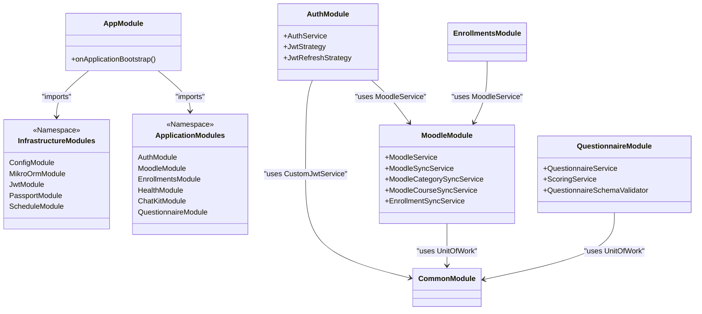

# Core Components

This document describes the high-level components, technology stack, and module architecture of the `api.faculytics` project.

## 1. System Overview

`api.faculytics` serves as an intermediary layer between Moodle and local institutional data. Its primary responsibilities include:

- **Authentication:** Authenticating users via Moodle tokens and issuing local JWTs.
- **Data Synchronization:** Mirroring Moodle's institutional hierarchy (Campuses, Semesters, Departments, Programs) and course enrollments.
- **Entity Management:** Maintaining a normalized local database for analytics and extended features.
- **Questionnaire Management:** Managing weighted questionnaires for student and faculty feedback.

## 2. Technology Stack

- **Backend Framework:** [NestJS](https://nestjs.com/) (v10+)
- **Database ORM:** [MikroORM](https://mikro-orm.io/) with PostgreSQL
- **Authentication:** Passport.js (JWT and Refresh Token strategies)
- **External API:** Moodle Web Services (REST)
- **Task Scheduling:** NestJS Schedule (Cron)
- **Validation:** Zod (Environment variables), class-validator (DTOs)

## 3. Module Architecture

The application is structured into **Infrastructure** and **Application** layers, coordinated by the `AppModule`.

## 4. Startup & Initialization Flow

The application enforces a strict initialization sequence in `InitializeDatabase` before it begins accepting traffic. This ensures that the database schema and required infrastructure state are always synchronized with the code.

1.  **Migration (`orm.migrator.up()`):** Automatically applies any pending database migrations.
2.  **Infrastructure Seeding (`orm.seeder.seed(DatabaseSeeder)`):** Executes idempotent seeders (e.g., `DimensionSeeder`) to populate required reference data.
3.  **Application Bootstrap:** Only after both steps succeed does `app.listen()` execute. If any step fails, the process exits with code 1.
