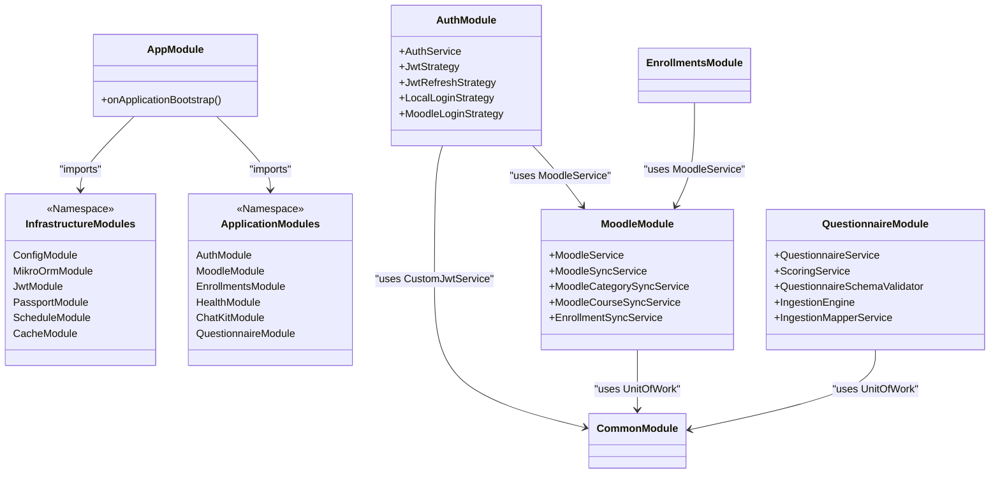

# Core Components

This document describes the high-level components, technology stack, and module architecture of the `api.faculytics` project.

## 1. System Overview

`api.faculytics` serves as an intermediary layer between Moodle and local institutional data. Its primary responsibilities include:

- **Authentication:** Authenticating users via Moodle tokens and issuing local JWTs.
- **Data Synchronization:** Mirroring Moodle's institutional hierarchy (Campuses, Semesters, Departments, Programs) and course enrollments.
- **Entity Management:** Maintaining a normalized local database for analytics and extended features.
- **Questionnaire Management:** Managing weighted questionnaires for student and faculty feedback. See [Questionnaire Management](./questionnaire-management.md) for detailed architecture.

## 2. Technology Stack

- **Backend Framework:** [NestJS](https://nestjs.com/) (v10+)
- **Database ORM:** [MikroORM](https://mikro-orm.io/) with PostgreSQL
- **Authentication:** Passport.js (JWT and Refresh Token strategies)
- **External API:** Moodle Web Services (REST)
- **Task Scheduling:** NestJS Schedule (Cron)
- **Caching:** `@nestjs/cache-manager` with Redis (`@keyv/redis`) or in-memory fallback
- **Validation:** Zod (Environment variables), class-validator (DTOs)

## 3. Module Architecture

The application is structured into **Infrastructure** and **Application** layers, coordinated by the `AppModule`.

```mermaid
classDiagram
    class AppModule {
        +onApplicationBootstrap()
    }
    class InfrastructureModules {
        <<Namespace>>
        ConfigModule
        MikroOrmModule
        JwtModule
        PassportModule
        ScheduleModule
        CacheModule
    }
    class ApplicationModules {
        <<Namespace>>
        AuthModule
        MoodleModule
        EnrollmentsModule
        HealthModule
        ChatKitModule
        QuestionnaireModule
    }

    AppModule --> InfrastructureModules : "imports"
    AppModule --> ApplicationModules : "imports"

    AuthModule --> MoodleModule : "uses MoodleService"
    AuthModule --> CommonModule : "uses CustomJwtService"
    MoodleModule --> CommonModule : "uses UnitOfWork"
    EnrollmentsModule --> MoodleModule : "uses MoodleService"
    QuestionnaireModule --> CommonModule : "uses UnitOfWork"

    class MoodleModule {
        +MoodleService
        +MoodleSyncService
        +MoodleCategorySyncService
        +MoodleCourseSyncService
        +EnrollmentSyncService
    }

    class AuthModule {
        +AuthService
        +JwtStrategy
        +JwtRefreshStrategy
        +LocalLoginStrategy
        +MoodleLoginStrategy
    }

    class QuestionnaireModule {
        +QuestionnaireService
        +ScoringService
        +QuestionnaireSchemaValidator
        +IngestionEngine
        +IngestionMapperService
    }
```

## 4. Login Strategy Pattern

Authentication uses a priority-based strategy pattern (`src/modules/auth/strategies/`). Each strategy implements the `LoginStrategy` interface:

- **`CanHandle(localUser, body)`**: Determines if this strategy applies to the login request.
- **`Execute(em, localUser, body)`**: Performs authentication and returns the user + optional Moodle token.
- **`priority`**: Numeric ordering (lower = higher precedence).

| Strategy              | Priority | When it handles                                 |
| --------------------- | -------- | ----------------------------------------------- |
| `LocalLoginStrategy`  | 10       | User exists and has a local password            |
| `MoodleLoginStrategy` | 100      | User has no local password or doesn't exist yet |

Priority ranges: `0-99` core auth, `100-199` external providers, `200+` fallbacks. To add a new provider, implement `LoginStrategy` and register it under the `LOGIN_STRATEGIES` injection token.

## 5. Cron Jobs

Background jobs extend `BaseJob` and register in `StartupJobRegistry`. All jobs are in `src/crons/jobs/`.

| Job                      | Schedule       | Purpose                                                               |
| ------------------------ | -------------- | --------------------------------------------------------------------- |
| `CategorySyncJob`        | Startup + cron | Syncs Moodle categories to local hierarchy                            |
| `CourseSyncJob`          | Startup + cron | Syncs Moodle courses                                                  |
| `EnrollmentSyncJob`      | Startup + cron | Syncs user-course enrollments and roles; invalidates enrollment cache |
| `RefreshTokenCleanupJob` | Every 12 hours | Purges refresh tokens older than 7 days                               |

## 6. Moodle Connectivity & Error Handling

The `MoodleClient` enforces a 10-second timeout (`MOODLE_REQUEST_TIMEOUT_MS`) on all Moodle API calls via `AbortSignal.timeout()`. Network failures are wrapped in `MoodleConnectivityError`:

- **Timeout**: `"Moodle request timed out during {operation}"`
- **Connection failure**: `"Failed to connect to Moodle service during {operation}"`
- **General network error**: `"Network error during Moodle {operation}"`

The `MoodleLoginStrategy` catches `MoodleConnectivityError` and translates it to a `401 Unauthorized` with a user-friendly message.

## 7. Startup & Initialization Flow

The application enforces a strict initialization sequence in `InitializeDatabase` before it begins accepting traffic. This ensures that the database schema and required infrastructure state are always synchronized with the code.

1.  **Migration (`orm.migrator.up()`):** Automatically applies any pending database migrations.
2.  **Infrastructure Seeding (`orm.seeder.seed(DatabaseSeeder)`):** Executes idempotent seeders (e.g., `DimensionSeeder`) to populate required reference data.
3.  **Application Bootstrap:** Only after both steps succeed does `app.listen()` execute. If any step fails, the process exits with code 1.
