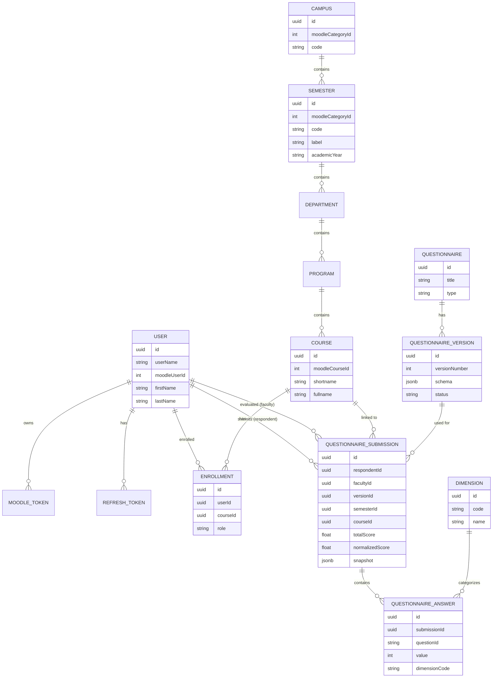

# Data Model (ERD)

The database schema reflects the institutional hierarchy derived from Moodle's category structure and the questionnaire management system.

```mermaid
erDiagram
    USER ||--o{ MOODLE_TOKEN : "owns"
    USER ||--o{ REFRESH_TOKEN : "has"
    USER ||--o{ ENROLLMENT : "enrolled"
    USER ||--o{ QUESTIONNAIRE_SUBMISSION : "submits (respondent)"
    USER ||--o{ QUESTIONNAIRE_SUBMISSION : "evaluated (faculty)"

    CAMPUS ||--o{ SEMESTER : "contains"
    SEMESTER ||--o{ DEPARTMENT : "contains"
    DEPARTMENT ||--o{ PROGRAM : "contains"
    PROGRAM ||--o{ COURSE : "contains"

    COURSE ||--o{ ENROLLMENT : "has"
    COURSE ||--o{ QUESTIONNAIRE_SUBMISSION : "linked to"

    QUESTIONNAIRE ||--o{ QUESTIONNAIRE_VERSION : "has"
    QUESTIONNAIRE_VERSION ||--o{ QUESTIONNAIRE_SUBMISSION : "used for"
    QUESTIONNAIRE_SUBMISSION ||--o{ QUESTIONNAIRE_ANSWER : "contains"
    DIMENSION ||--o{ QUESTIONNAIRE_ANSWER : "categorizes"

    USER {
        uuid id
        string userName
        int moodleUserId
        string firstName
        string lastName
    }

    CAMPUS {
        uuid id
        int moodleCategoryId
        string code
    }

    SEMESTER {
        uuid id
        int moodleCategoryId
        string code
        string label
        string academicYear
    }

    COURSE {
        uuid id
        int moodleCourseId
        string shortname
        string fullname
    }

    ENROLLMENT {
        uuid id
        uuid userId
        uuid courseId
        string role
    }

    QUESTIONNAIRE {
        uuid id
        string title
        string type
    }

    QUESTIONNAIRE_VERSION {
        uuid id
        int versionNumber
        jsonb schema
        string status
    }

    QUESTIONNAIRE_SUBMISSION {
        uuid id
        uuid respondentId
        uuid facultyId
        uuid versionId
        uuid semesterId
        uuid courseId
        float totalScore
        float normalizedScore
        jsonb snapshot
    }

    QUESTIONNAIRE_ANSWER {
        uuid id
        uuid submissionId
        string questionId
        int value
        string dimensionCode
    }

    DIMENSION {
        uuid id
        string code
        string name
    }
```
