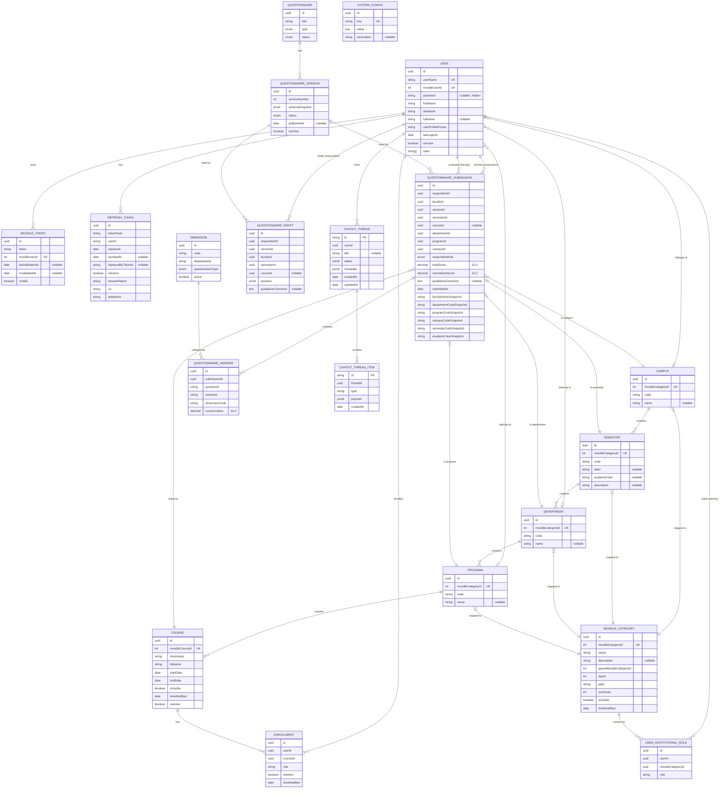

# Data Model (ERD)

The database schema reflects the institutional hierarchy derived from Moodle's category structure, the questionnaire management system, and supporting modules (ChatKit, system config).

## Core Domain

```mermaid
erDiagram
    USER ||--o{ MOODLE_TOKEN : "owns"
    USER ||--o{ REFRESH_TOKEN : "has"
    USER ||--o{ ENROLLMENT : "enrolled"
    USER ||--o{ USER_INSTITUTIONAL_ROLE : "holds authority"
    USER ||--o{ QUESTIONNAIRE_SUBMISSION : "submits (respondent)"
    USER ||--o{ QUESTIONNAIRE_SUBMISSION : "evaluated (faculty)"
    USER ||--o{ QUESTIONNAIRE_DRAFT : "drafts (respondent)"
    USER ||--o{ CHATKIT_THREAD : "owns"
    USER }o--o| CAMPUS : "belongs to"
    USER }o--o| DEPARTMENT : "belongs to"
    USER }o--o| PROGRAM : "belongs to"

    MOODLE_CATEGORY ||--o{ USER_INSTITUTIONAL_ROLE : "context for"
    CAMPUS }|--|| MOODLE_CATEGORY : "mapped to"
    SEMESTER }|--|| MOODLE_CATEGORY : "mapped to"
    DEPARTMENT }|--|| MOODLE_CATEGORY : "mapped to"
    PROGRAM }|--|| MOODLE_CATEGORY : "mapped to"

    CAMPUS ||--o{ SEMESTER : "contains"
    SEMESTER ||--o{ DEPARTMENT : "contains"
    DEPARTMENT ||--o{ PROGRAM : "contains"
    PROGRAM ||--o{ COURSE : "contains"

    COURSE ||--o{ ENROLLMENT : "has"
    COURSE ||--o{ QUESTIONNAIRE_SUBMISSION : "linked to"

    QUESTIONNAIRE ||--o{ QUESTIONNAIRE_VERSION : "has"
    QUESTIONNAIRE_VERSION ||--o{ QUESTIONNAIRE_SUBMISSION : "used for"
    QUESTIONNAIRE_VERSION ||--o{ QUESTIONNAIRE_DRAFT : "draft for"
    QUESTIONNAIRE_SUBMISSION ||--o{ QUESTIONNAIRE_ANSWER : "contains"
    QUESTIONNAIRE_SUBMISSION }|--|| SEMESTER : "in semester"
    QUESTIONNAIRE_SUBMISSION }|--|| DEPARTMENT : "in department"
    QUESTIONNAIRE_SUBMISSION }|--|| PROGRAM : "in program"
    QUESTIONNAIRE_SUBMISSION }|--|| CAMPUS : "in campus"
    DIMENSION ||--o{ QUESTIONNAIRE_ANSWER : "categorizes"

    CHATKIT_THREAD ||--o{ CHATKIT_THREAD_ITEM : "contains"

    USER {
        uuid id
        string userName UK
        int moodleUserId UK
        string password "nullable, hidden"
        string firstName
        string lastName
        string fullName "nullable"
        string userProfilePicture
        date lastLoginAt
        boolean isActive
        string[] roles
    }

    MOODLE_TOKEN {
        uuid id
        string token
        int moodleUserId UK
        date lastValidatedAt "nullable"
        date invalidatedAt "nullable"
        boolean isValid
    }

    REFRESH_TOKEN {
        uuid id
        string tokenHash
        string userId
        date expiresAt
        date revokedAt "nullable"
        string replacedByTokenId "nullable"
        boolean isActive
        string browserName
        string os
        string ipAddress
    }

    USER_INSTITUTIONAL_ROLE {
        uuid id
        uuid userId
        uuid moodleCategoryId
        string role
    }

    MOODLE_CATEGORY {
        uuid id
        int moodleCategoryId UK
        string name
        string description "nullable"
        int parentMoodleCategoryId
        int depth
        string path
        int sortOrder
        boolean isVisible
        date timeModified
    }

    CAMPUS {
        uuid id
        int moodleCategoryId UK
        string code
        string name "nullable"
    }

    SEMESTER {
        uuid id
        int moodleCategoryId UK
        string code
        string label "nullable"
        string academicYear "nullable"
        string description "nullable"
    }

    DEPARTMENT {
        uuid id
        int moodleCategoryId UK
        string code
        string name "nullable"
    }

    PROGRAM {
        uuid id
        int moodleCategoryId UK
        string code
        string name "nullable"
    }

    COURSE {
        uuid id
        int moodleCourseId UK
        string shortname
        string fullname
        date startDate
        date endDate
        boolean isVisible
        date timeModified
        boolean isActive
    }

    ENROLLMENT {
        uuid id
        uuid userId
        uuid courseId
        string role
        boolean isActive
        date timeModified
    }

    QUESTIONNAIRE {
        uuid id
        string title
        enum type
        enum status
    }

    QUESTIONNAIRE_VERSION {
        uuid id
        int versionNumber
        jsonb schemaSnapshot
        enum status
        date publishedAt "nullable"
        boolean isActive
    }

    QUESTIONNAIRE_SUBMISSION {
        uuid id
        uuid respondentId
        uuid facultyId
        uuid versionId
        uuid semesterId
        uuid courseId "nullable"
        uuid departmentId
        uuid programId
        uuid campusId
        enum respondentRole
        decimal totalScore "10,2"
        decimal normalizedScore "10,2"
        text qualitativeComment "nullable"
        date submittedAt
        string facultyNameSnapshot
        string departmentCodeSnapshot
        string programCodeSnapshot
        string campusCodeSnapshot
        string semesterCodeSnapshot
        string academicYearSnapshot
    }

    QUESTIONNAIRE_ANSWER {
        uuid id
        uuid submissionId
        string questionId
        string sectionId
        string dimensionCode
        decimal numericValue "10,2"
    }

    QUESTIONNAIRE_DRAFT {
        uuid id
        uuid respondentId
        uuid versionId
        uuid facultyId
        uuid semesterId
        uuid courseId "nullable"
        jsonb answers
        text qualitativeComment "nullable"
    }

    DIMENSION {
        uuid id
        string code
        string displayName
        enum questionnaireType
        boolean active
    }

    SYSTEM_CONFIG {
        uuid id
        string key UK
        text value
        string description "nullable"
    }

    CHATKIT_THREAD {
        string id PK
        uuid userId
        string title "nullable"
        jsonb status
        jsonb metadata
        date createdAt
        date updatedAt
    }

    CHATKIT_THREAD_ITEM {
        string id PK
        uuid threadId
        string type
        jsonb payload
        date createdAt
    }
```

### Constraints & Idempotency

- **Dimension Registry:** Composite unique on `(code, questionnaireType)`. Allows the same code (e.g., 'PLANNING') across different questionnaire types.
- **Enrollment:** Composite unique on `(user, course)`. Prevents duplicate enrollments.
- **User Institutional Role:** Composite unique on `(user, moodleCategory, role)`.
- **Questionnaire Version:** Composite unique on `(questionnaire, versionNumber)`.
- **Questionnaire Submission:** Composite unique on `(respondent, faculty, questionnaireVersion, semester, course)`. Indexed on `(faculty, semester)`, `(department, semester)`, `(program, semester)`, `(campus, semester)`.
- **Questionnaire Draft:** Partial unique indexes handling nullable `course_id` and soft deletes.

### Institutional Snapshots

`QUESTIONNAIRE_SUBMISSION` stores denormalized snapshots of institutional data at submission time (faculty name, department code, program code, campus code, semester, academic year). This decouples historical submissions from future hierarchy changes — if a department is renamed, existing submission reports retain the original values.

### Notes

- All entities except `CHATKIT_THREAD` and `CHATKIT_THREAD_ITEM` extend `CustomBaseEntity` (UUID pk, `createdAt`, `updatedAt`, `deletedAt` with soft-delete filter).
- `REFRESH_TOKEN` stores `userId` as a string rather than a foreign key relation.
- `SYSTEM_CONFIG` is a standalone key-value store with no relationships.
