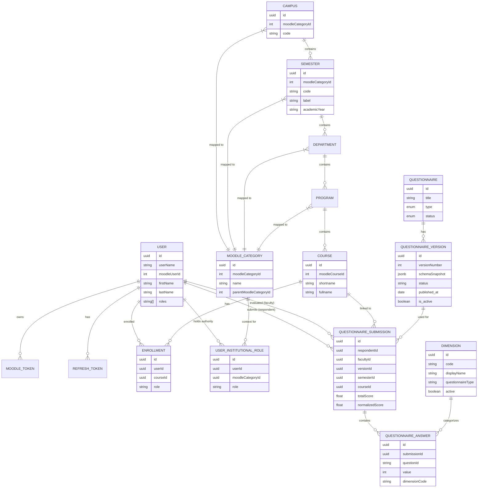

# Data Model (ERD)

The database schema reflects the institutional hierarchy derived from Moodle's category structure and the questionnaire management system.

### Constraints & Idempotency

- **Dimension Registry:** Enforced by a composite unique constraint on `(code, questionnaireType)`. This prevents duplicate dimensions for the same questionnaire context while allowing the same code (e.g., 'PLANNING') to exist across different types if necessary.
