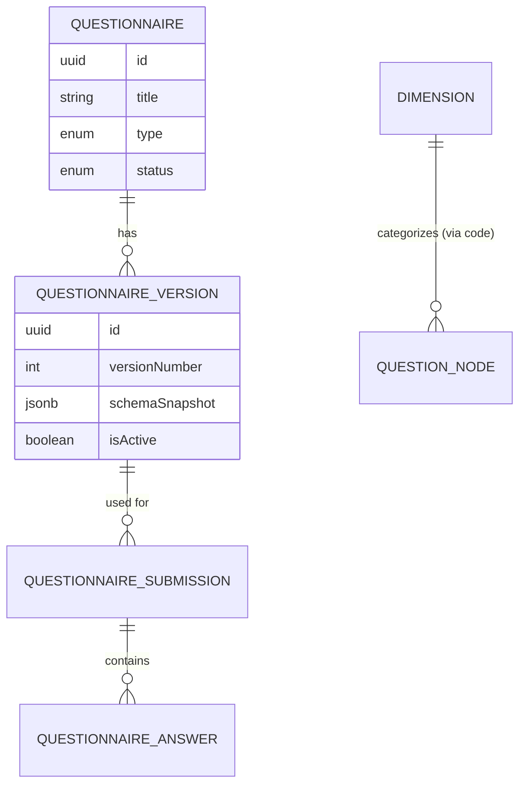
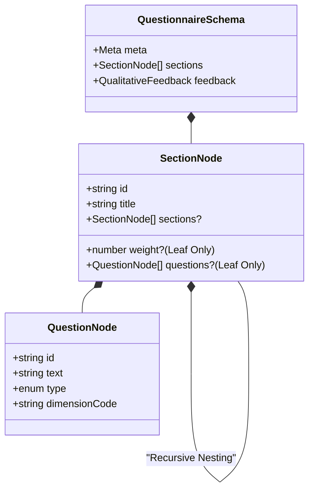
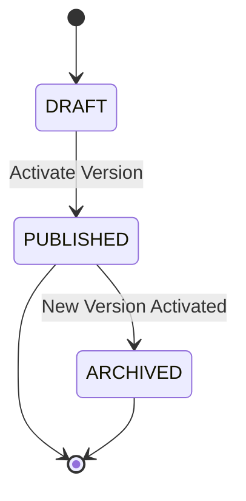

# Questionnaire Management System

The Questionnaire Management system is designed to handle complex, hierarchical assessment frameworks with strict mathematical integrity for scoring and longitudinal tracking.

## 1. Core Data Model

The system separates the identity of a questionnaire from its specific content versions.

## 2. Schema Architecture (JSONB)

Instead of a complex relational tree for questions and sections (which makes versioning and querying slow), we use a **validated JSONB tree**. This allows for recursive nesting while maintaining high performance.

### Structural Rules (Recursive Hierarchy)

### The "Leaf-Weight" Rule

To ensure scoring mathematical integrity, the following rules are enforced by the `QuestionnaireSchemaValidator`:

1.  **Mutual Exclusivity**: A section can either contain sub-sections **OR** questions, never both.
2.  **Weight Placement**: Weights (`number`) can **ONLY** be assigned to "Leaf" sections (sections containing questions).
3.  **The 100% Rule**: The sum of all leaf section weights within a single version must equal exactly **100**.

**Why?** This guarantees that every question belongs to a weighted bucket, making the calculation of a normalized score (0-100) mathematically trivial and deterministic.

## 3. Versioning & Immutability

Questionnaires follow a strict lifecycle to ensure that historical submission data remains valid even if the questionnaire changes.

- **Immutability**: Once a `QuestionnaireVersion` has a single `Submission` linked to it, it is locked. Any changes require the creation of a new `versionNumber`.
- **Snapshots**: Every submission stores a `schemaSnapshot` reference to the version used, ensuring that even if a version is deleted (rare), the context of the answers is preserved.

## 4. Design Justifications

### Why JSONB for the Schema?

- **Flexibility**: Institutional questionnaires often change structure (adding sub-sections). JSONB handles this without schema migrations.
- **Atomic Loading**: Fetching a complete questionnaire for the UI requires one database read instead of recursive joins.
- **Integrity**: We use NestJS/Zod and a custom `QuestionnaireSchemaValidator` to ensure the JSON matches our strict rules before it ever hits the database.

### Why Decouple Dimensions?

Dimensions (e.g., "Clarity", "Organization") are stored in a global registry. Question nodes in the JSON schema reference these by a stable `dimensionCode`.

- **Cross-Questionnaire Analytics**: This allows the system to compare "Clarity" scores across different types of questionnaires (Student Feedback vs. Peer Review).

### Institutional Snapshotting

When a questionnaire is submitted, we don't just store IDs. We snapshot the current `Campus`, `Department`, and `Course` names.

- **Justification**: If a Department is renamed next year, historical feedback for "Dept A" should not retroactively move to "Dept B" in reports. It preserves the institutional state at the moment of feedback.

## 5. Bulk Ingestion & Orchestration

The system provides a robust orchestration layer for ingesting bulk questionnaire data from external sources (e.g., historical CSVs, external APIs).

### The Ingestion Engine

The `IngestionEngine` processes asynchronous streams of submission data using a high-performance orchestration model:

- **Bounded Concurrency:** Processes multiple records simultaneously using `p-limit` (default 6) to maximize throughput without overwhelming the database connection pool.
- **Per-Record Isolation:** Each record is processed in a forked `EntityManager` and its own transaction. A failure in one record does not affect others.
- **Speculative Dry-Runs:** Executes the complete business logic, including database constraints and triggers, but uses a custom `DryRunRollbackError` to ensure the transaction is always rolled back.
- **Deduplicated Mapping:** Uses `IngestionMapperService` with a request-scoped `DataLoader` to cache institutional entity lookups (Users, Courses, Semesters) across concurrent workers.
- **Resource Safety:** Implements hard memory limits (5,000 records) and automatic backpressure if the processing queue grows too large.

### Concrete Adapters (CSV & Excel)

- **Streaming-first**: Both adapters return `AsyncIterable<IngestionRecord>` and never buffer the entire file.
- **Header normalization**: Keys are trimmed, lowercased, stripped of non-alphanumerics (keeping `_` and `-`), and de-duplicated with suffixes (`_1`, `_2`).
- **CSV configuration**: Supports `delimiter`, `quote`, `escape`, and `separator` options.
- **Excel configuration**: Supports `sheetName` or 1-based `sheetIndex` selection.
- **Row identification**: `sourceIdentifier` is 1-based for data rows (header row excluded).
