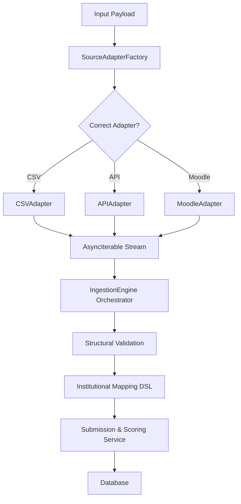

# Universal Ingestion Architecture

The Universal Ingestion system provides a unified interface for importing `QuestionnaireSubmission` data from diverse external sources (CSV/Excel files, Moodle API, or external third-party APIs).

## 1. Design Philosophy

- **Decoupled Extraction**: The logic for reading raw data (CSV, API) is separated from the logic of mapping it to internal institutional dimensions.
- **Streaming First**: Utilizes `AsyncIterable` to handle large datasets (e.g., a 100k row CSV) with low memory overhead.
- **Fail-Early Validation**: Structural validation (Zod) happens at the adapter level to ensure the ingestion engine only processes readable records.
- **Stateless Adapters**: Adapters do not maintain state or perform database writes; they only extract and yield standardized raw records.

## 2. Component Structure

### SourceAdapter

The core interface for all data sources.

```typescript
export interface SourceAdapter<TPayload, TData = unknown> {
  extract(
    payload: TPayload,
    config: SourceConfiguration,
  ): AsyncIterable<IngestionRecord<TData>>;
  close?(): Promise<void>;
}
```

### IngestionRecord

Standardized wrapper for yielded data, including error tracking.

```typescript
export interface IngestionRecord<T> {
  data?: T;
  error?: string;
  sourceIdentifier: string | number | Record<string, unknown>;
}
```

### SourceAdapterFactory

Resolves the correct adapter implementation based on the `SourceType`.

- **CSV**: `SOURCE_ADAPTER_CSV`
- **EXCEL**: `SOURCE_ADAPTER_EXCEL`
- **MOODLE**: `SOURCE_ADAPTER_MOODLE`
- **API**: `SOURCE_ADAPTER_API`

## 3. Ingestion Flow

The orchestration of the ingestion process is handled by the `IngestionEngine` (Upcoming).



## 4. Key Configurations

- **dryRun**: When enabled, the engine validates and processes the entire stream but skips the final database persistence. Returns a full summary of potential successes and errors.
- **maxErrors**: Threshold for terminating the stream. If errors (parsing or mapping) exceed this limit, the engine halts to prevent massive log bloat or OOM scenarios.
