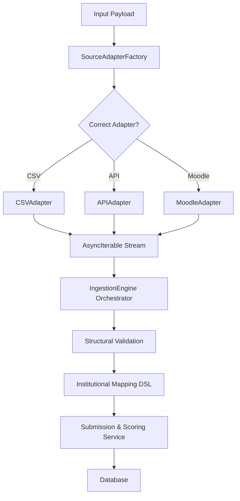

# Universal Ingestion Architecture

The Universal Ingestion system provides a unified interface for importing `QuestionnaireSubmission` data from diverse external sources (CSV/Excel files, Moodle API, or external third-party APIs).

## 1. Design Philosophy

- **Decoupled Extraction**: The logic for reading raw data (CSV, API) is separated from the logic of mapping it to internal institutional dimensions.
- **Streaming First**: Utilizes `AsyncIterable` to handle large datasets (e.g., a 100k row CSV) with low memory overhead.
- **Fail-Early Parsing**: Adapters normalize and validate incoming rows, emitting `IngestionRecord.error` when malformed while continuing the stream.
- **Stateless Adapters**: Adapters do not maintain state or perform database writes; they only extract and yield standardized raw records.

## 2. Component Structure

### SourceAdapter

The core interface for all data sources.

```typescript
export interface SourceAdapter<TPayload, TData = unknown> {
  extract(
    payload: TPayload,
    config: SourceConfiguration,
  ): AsyncIterable<IngestionRecord<TData>>;
  close?(): Promise<void>;
}
```

### BaseStreamAdapter

Shared adapter base class for stream-based sources. It handles key normalization and safe cleanup.

- **Key normalization**: `trim -> lowercase -> remove non-alphanumeric (keep _ and -)`.
- **Collision handling**: Adds suffixes like `_1`, `_2` when normalized keys collide.
- **Empty headers**: Uses `column_{index}` fallback.
- **Resource cleanup**: Destroys the payload stream when iteration completes or aborts.

### FileStorageProvider

Storage abstraction for retrieving a `NodeJS.ReadableStream` by storage key.

```typescript
export interface FileStorageProvider {
  getStream(storageKey: string): Promise<NodeJS.ReadableStream>;
}
```

### IngestionRecord

Standardized wrapper for yielded data, including error tracking.

```typescript
export interface IngestionRecord<T> {
  data?: T;
  error?: string;
  sourceIdentifier: string | number | Record<string, unknown>;
}
```

### SourceAdapterFactory

Resolves the correct adapter implementation based on the `SourceType`.

- **CSV**: `${SOURCE_ADAPTER_PREFIX}${SourceType.CSV}`
- **EXCEL**: `${SOURCE_ADAPTER_PREFIX}${SourceType.EXCEL}`
- **MOODLE**: `${SOURCE_ADAPTER_PREFIX}${SourceType.MOODLE}`
- **API**: `${SOURCE_ADAPTER_PREFIX}${SourceType.API}`

Adapters are registered in `QuestionnaireModule` using `useExisting` bindings for `CSVAdapter` and `ExcelAdapter`.

## 3. Ingestion Flow

The orchestration of the ingestion process is handled by the `IngestionEngine`. It consumes an `AsyncIterable` stream from an adapter and manages the following:

- **Bounded Concurrency:** Uses `p-limit` to process multiple records simultaneously (default: 6).
- **Transactional Isolation:** Each record is processed in a forked `EntityManager` and a dedicated transaction.
- **Speculative Dry-Run:** Executes full database logic but rolls back the transaction using a custom `DryRunRollbackError`.
- **Resource Management:** Ensures adapters are closed and memory is cleared (`em.clear()`) after each record.
- **Mapping:** Leverages `IngestionMapperService` for institutional context resolution.

### CSV Adapter Behavior

- **Streaming parser**: `csv-parser` with configurable `delimiter`, `quote`, `escape`, and `separator`.
- **Row indexing**: `sourceIdentifier` is 1-based, representing data rows after headers.
- **Column mismatch**: Emits an error record when row column counts differ from header count.

#### CSV Example Config

```typescript
const config: CSVAdapterConfig = {
  delimiter: ',',
  quote: '"',
  escape: '"',
};
```

### Excel Adapter Behavior

- **Streaming reader**: `exceljs` `WorkbookReader` for memory safety.
- **Sheet selection**: `sheetName` (string) or `sheetIndex` (number, 1-based), defaulting to the first sheet.
- **Row indexing**: `sourceIdentifier` is 1-based for data rows (header row excluded).

#### Excel Example Config

```typescript
const config: ExcelAdapterConfig = {
  sheetName: 'Submissions',
  // sheetIndex: 1,
};
```



## 4. Key Configurations

- **dryRun**: When enabled, the engine validates and processes the entire stream but skips the final database persistence. Returns a full summary of potential successes and errors.
- **maxErrors**: Threshold for terminating the stream. If errors (parsing or mapping) exceed this limit, the engine halts to prevent massive log bloat or OOM scenarios.
