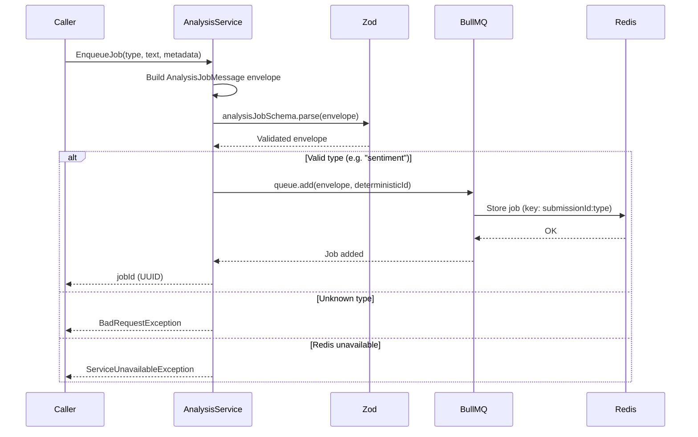
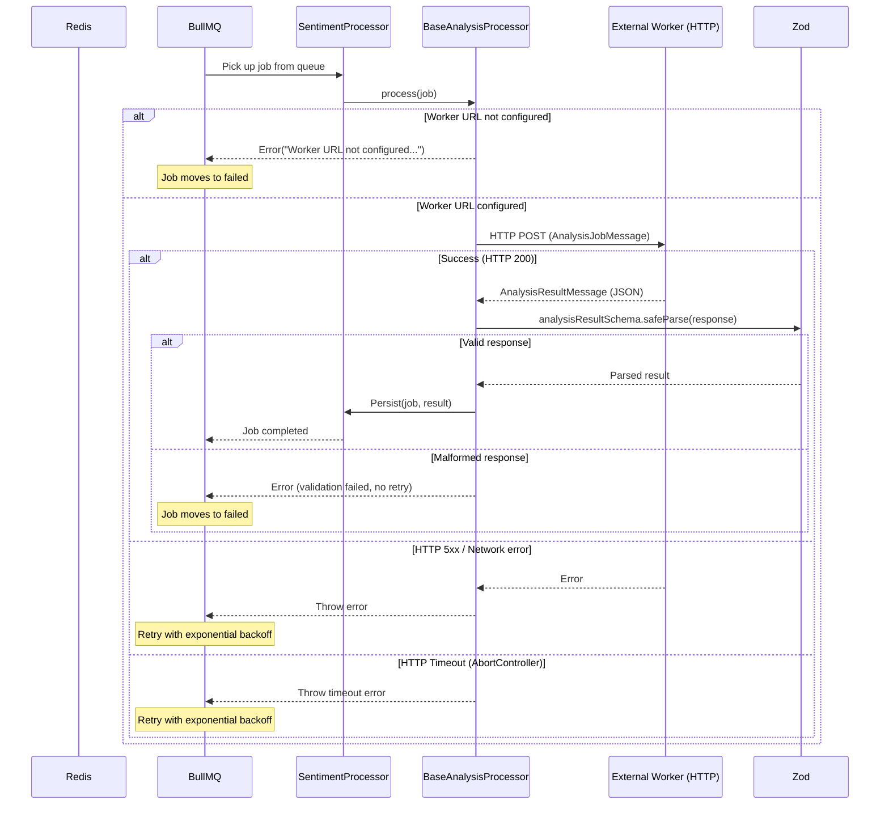
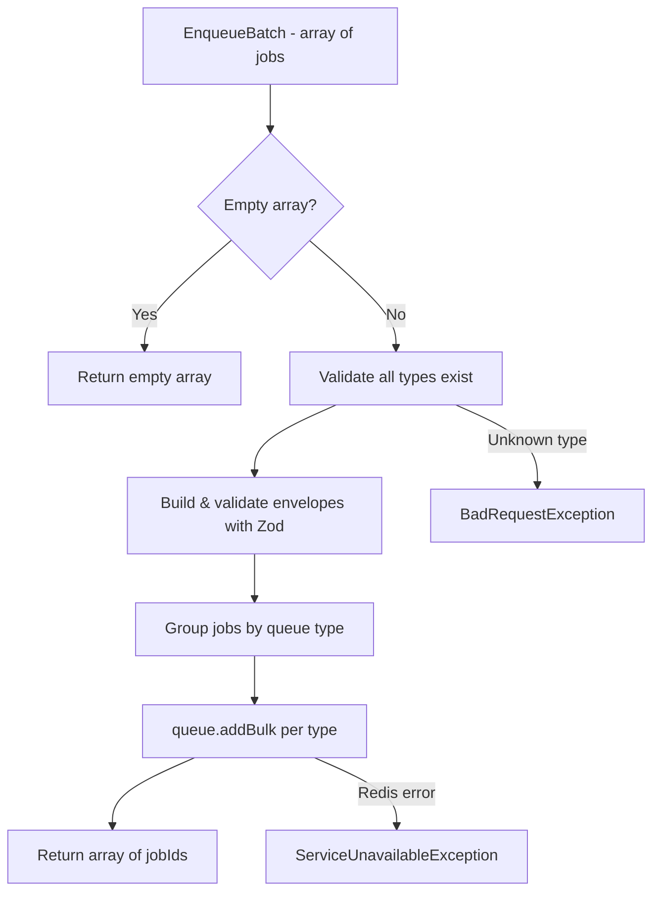
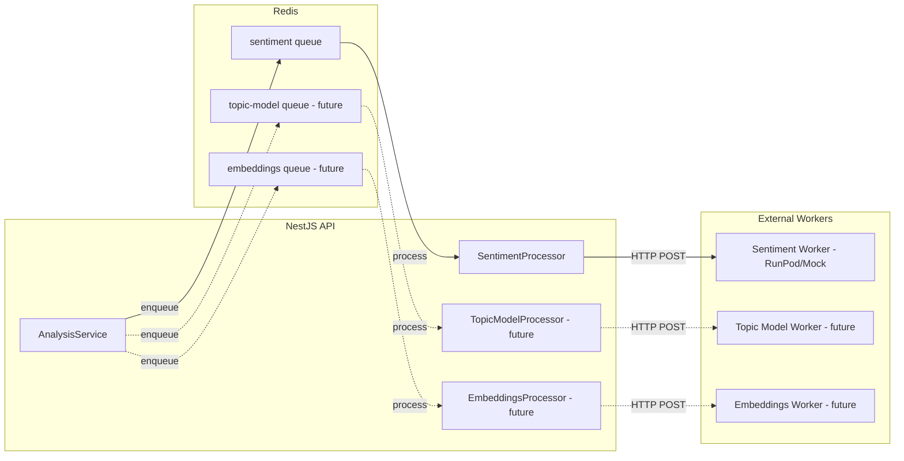

# Analysis Job Processing

The analysis system dispatches text analysis jobs to external HTTP workers (RunPod GPU endpoints, LLM APIs) via BullMQ queues, validates responses, and persists results.

## Job Enqueue Flow

## Job Processing Flow

## Batch Enqueue Flow

## Queue Architecture

## Deduplication

Jobs use a deterministic ID format: `${submissionId}:${type}`. If the same submission + analysis type combination is enqueued twice, BullMQ silently rejects the duplicate. This prevents redundant processing when upstream systems retry.

## Resilience

| Mechanism          | Configuration                               | Behavior                                                                |
| ------------------ | ------------------------------------------- | ----------------------------------------------------------------------- |
| Retry              | `BULLMQ_DEFAULT_ATTEMPTS` (default: 3)      | Exponential backoff starting at `BULLMQ_DEFAULT_BACKOFF_MS`             |
| HTTP Timeout       | `BULLMQ_HTTP_TIMEOUT_MS` (default: 90s)     | `AbortController` cancels request; job retries                          |
| Stall Detection    | `BULLMQ_STALLED_INTERVAL_MS` (default: 30s) | Re-queues stalled jobs up to `BULLMQ_MAX_STALLED_COUNT` times           |
| Validation Failure | —                                           | Malformed worker responses fail immediately (no retry)                  |
| Redis Down         | —                                           | `ServiceUnavailableException` returned to caller; API continues serving |

## Adding a New Analysis Type

1. Create `NewTypeProcessor extends BaseAnalysisProcessor` in `src/modules/analysis/processors/`
2. Add `NEW_TYPE_WORKER_URL` to `src/configurations/env/bullmq.env.ts`
3. Register queue in `AnalysisModule`: `BullModule.registerQueue({ name: 'new-type' })`
4. Add `@InjectQueue('new-type')` to `AnalysisService` and update the `queues` map
5. Add mock endpoint in `mock-worker/server.ts`
