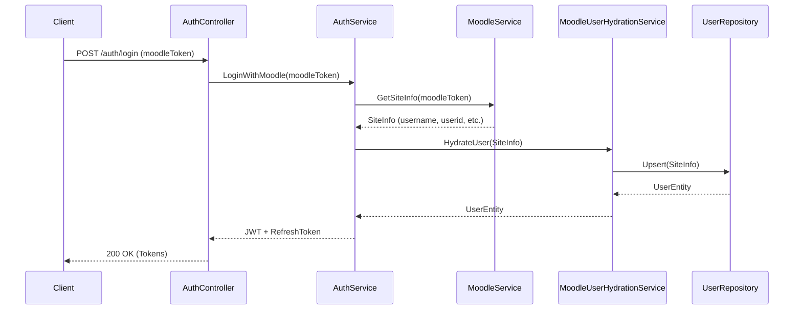

# Authentication & User Hydration

When a user logs in, the system synchronizes their Moodle profile information before issuing local tokens.

```mermaid
sequenceDiagram
    participant Client
    participant AuthController
    participant AuthService
    participant MoodleService
    participant MoodleUserHydrationService
    participant UserRepository

    Client->>AuthController: POST /auth/login (moodleToken)
    AuthController->>AuthService: LoginWithMoodle(moodleToken)
    AuthService->>MoodleService: GetSiteInfo(moodleToken)
    MoodleService-->>AuthService: SiteInfo (username, userid, etc.)
    AuthService->>MoodleUserHydrationService: HydrateUser(SiteInfo)
    MoodleUserHydrationService->>UserRepository: Upsert(SiteInfo)
    UserRepository-->>MoodleUserHydrationService: UserEntity
    MoodleUserHydrationService-->>AuthService: UserEntity
    AuthService-->>AuthController: JWT + RefreshToken
    AuthController-->>Client: 200 OK (Tokens)
```
