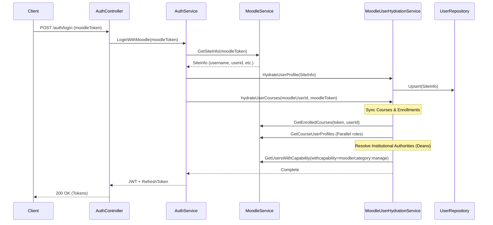

# Authentication & User Hydration

When a user logs in, the system synchronizes their Moodle profile information and institutional authorities (Enrollments and Dean roles) before issuing local tokens.

## Institutional Authority Resolution (Dean Mapping)

The system automatically detects if a user has management authorities over specific categories (Campuses, Departments, or Programs).

1.  **Capability Check:** For each unique category a user is enrolled in, the system picks a representative course.
2.  **Moodle Verification:** It queries Moodle to see if the current user has the `moodle/category:manage` capability in that context.
3.  **Role Persistence:** If found, a `UserInstitutionalRole` (e.g., 'dean') is recorded for that specific category.
4.  **Global Role Propagation:** The user's global `roles` array is updated to include 'dean' if any institutional authority is detected.
