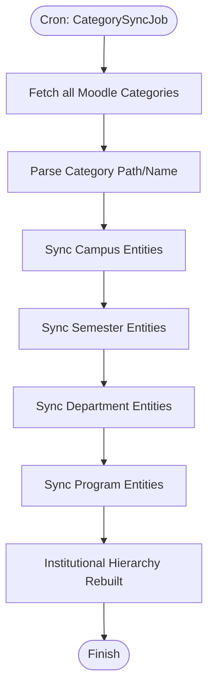

# Institutional Hierarchy Synchronization

The system uses background jobs to rebuild the local institutional hierarchy based on Moodle Categories.

```mermaid
flowchart TD
    Start([Cron: CategorySyncJob]) --> Fetch[Fetch all Moodle Categories]
    Fetch --> Parse[Parse Category Path/Name]
    Parse --> BuildCampus[Sync Campus Entities]
    BuildCampus --> BuildSemester[Sync Semester Entities]
    BuildSemester --> BuildDept[Sync Department Entities]
    BuildDept --> BuildProg[Sync Program Entities]
    BuildProg --> HierarchyReady[Institutional Hierarchy Rebuilt]
    HierarchyReady --> End([Finish])
```
