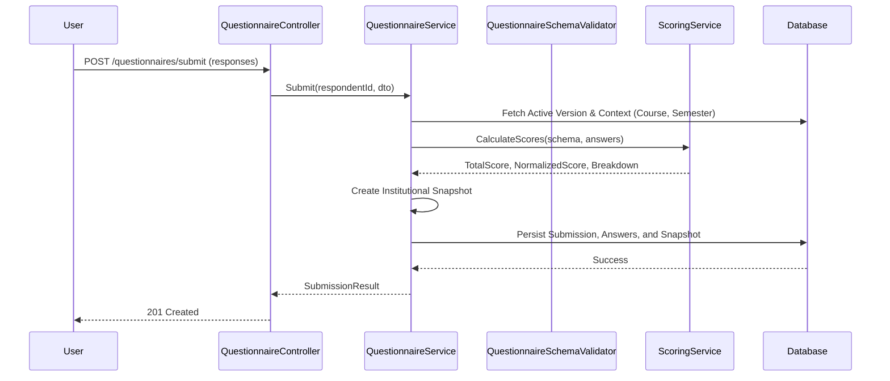
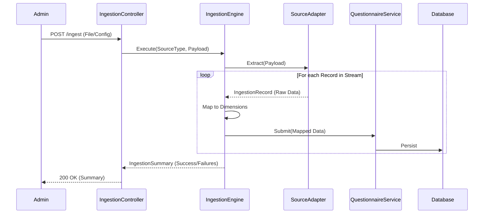

# Questionnaire Submission & Scoring

The questionnaire system handles recursive section weighting and institutional snapshotting during submission.

## Batch Ingestion Flow

In addition to direct API submissions, the system supports bulk ingestion via the Universal Ingestion Adapter. This is primarily used for importing historical data or synchronizing with external files (CSV/Excel).

For more details on the adapter design, see the [Universal Ingestion Architecture](../architecture/universal-ingestion.md).

### Adapter Notes

- CSV/Excel adapters stream records and emit `IngestionRecord.error` for malformed rows without stopping the stream.
- Header normalization trims, lowercases, and removes non-alphanumerics (keeping `_` and `-`) to align with DTO keys.
- `sourceIdentifier` is 1-based for data rows (header row excluded).
