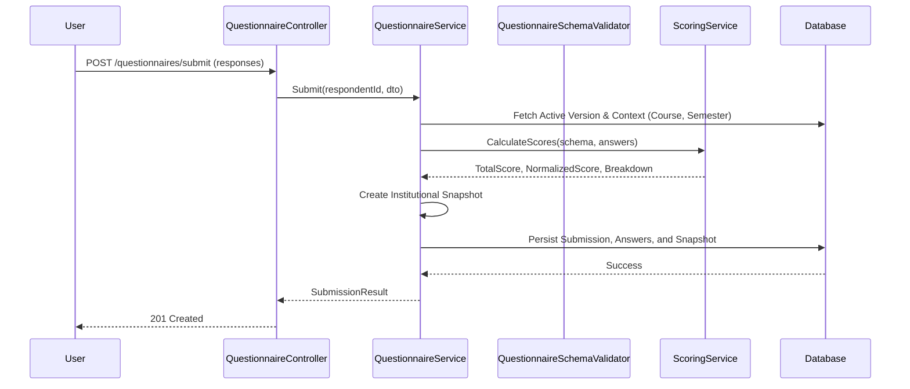

# Questionnaire Submission & Scoring

The questionnaire system handles recursive section weighting and institutional snapshotting during submission.

```mermaid
sequenceDiagram
    participant User
    participant QuestionnaireController
    participant QuestionnaireService
    participant QuestionnaireSchemaValidator
    participant ScoringService
    participant Database

    User->>QuestionnaireController: POST /questionnaires/submit (responses)
    QuestionnaireController->>QuestionnaireService: Submit(respondentId, dto)
    QuestionnaireService->>Database: Fetch Active Version & Context (Course, Semester)
    QuestionnaireService->>ScoringService: CalculateScores(schema, answers)
    ScoringService-->>QuestionnaireService: TotalScore, NormalizedScore, Breakdown
    QuestionnaireService->>QuestionnaireService: Create Institutional Snapshot
    QuestionnaireService->>Database: Persist Submission, Answers, and Snapshot
    Database-->>QuestionnaireService: Success
    QuestionnaireService-->>QuestionnaireController: SubmissionResult
    QuestionnaireController-->>User: 201 Created
```
